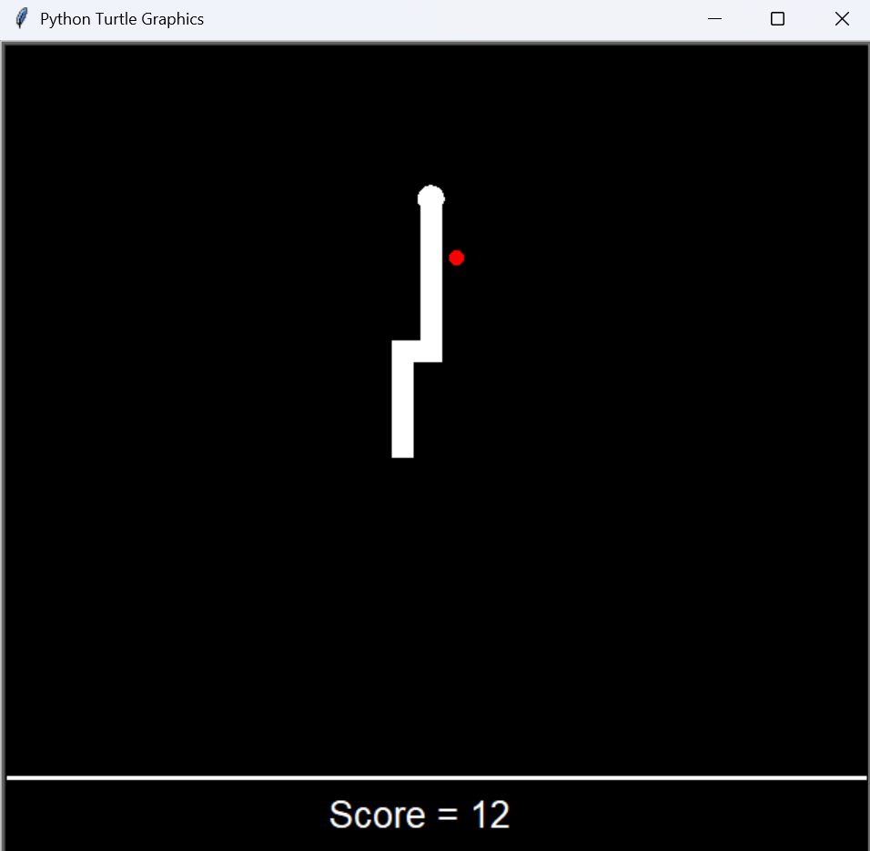
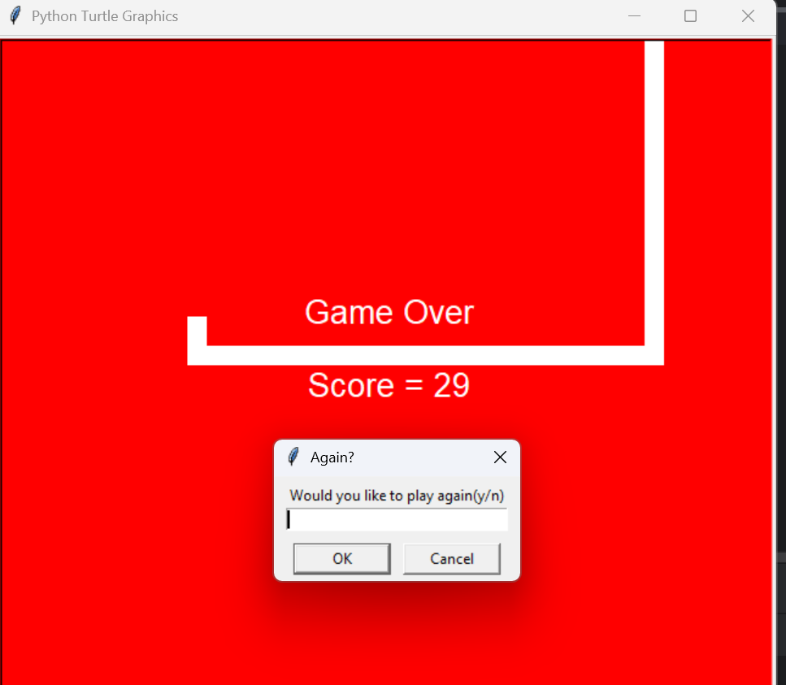

# 🐍 Snake Game — Python

> A Python remake of the classic Snake game, built with Object-Oriented Programming and the Turtle graphics library.


---

## About

This project was a milestone in my programming journey — a deep dive into **Object-Oriented Programming**, focusing on clean architecture, modularity, and inheritance. The codebase is split into two playable versions, each experimenting with a different game mechanic.

---

## Versions

| Version | Wall Behaviour | Difficulty |
|---|---|---|
| **Collision Mode** | Hitting a wall ends the game | Classic |
| **Screen-Wrap Mode** | Snake passes through walls and reappears on the opposite side | Modern twist |

---

## Project Structure

```
snake-game/
├── Collision Version/
│   ├── main.py       # Game loop and constants
│   ├── snake.py      # Snake movement and body segment logic
│   ├── food.py       # Food spawning and size types
│   ├── score.py      # Scoreboard and high-score persistence
│   └── score.txt     # Saved high score
└── Screen-Wrap Version/
    ├── main.py
    ├── snake.py      # Includes wall-wrap logic
    ├── food.py
    ├── score.py
    └── score.txt
```

---

## Features

### Gameplay

- **Two food types** — small food (+1 pt) and rare big food (+3 pts), each with a distinct visual size
- **Progressive difficulty** — the snake speeds up and grows longer with every meal
- **Persistent high score** — saved to `score.txt` between sessions; press **Space** to reset it

### Game Over Conditions

- **Self-collision** — the snake runs into its own body (both versions)
- **Wall collision** — the snake hits the boundary (Collision Mode only)

---

## Screenshots

| Gameplay | Game Over | Screen-Wrap |
|---|---|---|
|  |  |  |

---

## How to Run

### Option 1 — Download the executable (no Python required)

| Version | Download |
|---|---|
| Collision Mode | [SNAKE_GAME_Collision_Mode.exe](https://drive.google.com/file/d/1eXZoffdaONJgkMlchRyt3yXpQN08T7ZB/view?usp=drive_link) |
| Screen-Wrap Mode | [SNAKE_GAME_Screen_Wrap_Mode.exe](https://drive.google.com/file/d/10scYCkE1rq6ydxFmqbenQNGam5t0TfO7/view?usp=drive_link) |

### Option 2 — Run from source

**Requirements:** Python 3.x (Turtle is included in the standard library — no extra dependencies needed.)

```bash
# Clone the repository
git clone https://github.com/YourUsername/YourRepoName

# Navigate to your preferred version
cd "Collision Version"
# or
cd "Screen-Wrap Version"

# Run the game
python main.py
```

---

## Controls

| Key | Action |
|---|---|
| `↑ ↓ ← →` | Move the snake |
| `Space` | Clear the saved high score |

---

## OOP Design

The game is built around four classes, each with a single responsibility:

| Class | Inherits from | Responsibility |
|---|---|---|
| `Snake` | — | Movement, growth, collision detection |
| `Food` | `Turtle` | Random spawning, size variation |
| `Score` | `Turtle` | Scoreboard rendering, file I/O |
| *(Game loop)* | — | `main.py` orchestrates everything |

---

*Built with Python's `turtle` module — no external libraries required.*
